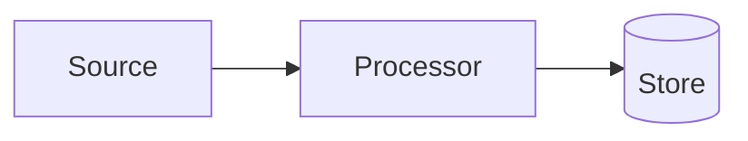

# Woodmark Marp Template

A self-contained [Marp](https://marp.app/) slide template that reproduces the
corporate **Woodmark Consulting** PowerPoint look — brand colours, Roboto Slab /
Source Sans fonts, the green *“Passion for data”* corner marker, sloped header
bands, the dark-green footer band, and slanted divider lines.

It also ships **build-time [Mermaid](https://mermaid.js.org/) rendering**: write
diagrams as plain ` ```mermaid ` code fences and they are exported as static,
on-brand SVG — identical in PDF, PPTX, PNG and HTML, with no CDN, no client-side
script, and no “insecure content” prompts.

---

## Contents

- [Prerequisites](#prerequisites)
- [Quick start](#quick-start)
- [Authoring a deck](#authoring-a-deck)
- [Slide layouts](#slide-layouts)
- [Inline helper classes](#inline-helper-classes)
- [Mermaid diagrams](#mermaid-diagrams)
- [Exporting](#exporting)
- [VS Code live preview](#vs-code-live-preview)
- [Brand reference](#brand-reference)
- [Project structure](#project-structure)
- [Troubleshooting](#troubleshooting)

---

## Prerequisites

- **Node.js** ≥ 18
- A **Chromium-based browser** for export (PDF / PPTX / PNG) and for Mermaid
  rendering. `npm install` downloads one automatically via Puppeteer; to use an
  existing browser instead, set `CHROME_PATH` (see [Troubleshooting](#troubleshooting)).
- *(Optional)* the [Marp for VS Code](https://marketplace.visualstudio.com/items?itemName=marp-team.marp-vscode)
  extension for live preview.

---

## Quick start

```bash
git clone <this-repo> wmc-marp-template
cd wmc-marp-template
npm install

# Render both decks to PDF+HTML:
npm run build:rendered             # -> decks/rendered/{starter,layout-test}.{pdf,html}

# Build any deck:
npm run build -- decks/starter.md -o decks/rendered/starter.pdf
```

Generated output goes to `decks/rendered/` and is git-ignored.

---

## Authoring a deck

Copy [`decks/starter.md`](decks/starter.md) and edit. The front-matter wires up
the theme:

```yaml
---
marp: true
theme: woodmark
paginate: true
header: 'My Presentation'
footer: '<span class="foot-date">01.01.2026</span>My Presentation · Internal · © Woodmark Consulting GmbH'
---
```

- `header` renders as the small uppercase **eyebrow label** (top-left).
- `footer` renders inside the **dark-green footer band**. The leading
  `<span class="foot-date">…</span>` is spaced away from the rest by the theme.
- `paginate: true` shows page numbers. Disable per slide with
  `<!-- _paginate: false -->`.
- The *“Passion for data”* marker is added to **every** slide automatically.

Separate slides with `---`. Set a layout on a slide with a local class directive
placed right after the separator:

```markdown
---

<!-- _class: banner -->

## My slide title
```

---

## Slide layouts

| Class         | Description                                                                |
| ------------- | -------------------------------------------------------------------------- |
| *(none)*      | Plain “title + content” slide on a white background.                       |
| `banner-subtitle` | Sloped green band + divider line — **with subtitle** (line sits lower). |
| `banner`      | Same band, no subtitle slot — title-focused.                               |
| `sidebar`     | Title in a left light-green panel; content on the right.                   |
| `steps`       | Like `sidebar`, but list items get numbered circle markers on the divider. |
| `columns`     | Body text flows into **two balanced columns**.                             |
| `statement`   | Centered “big statement” slide (large title, minimal content).             |
| `lead`        | Title / closing slide — centered; used for the cover and “Questions?”.     |

The header band (`banner*`) and the two-column body (`columns`) are independent
modifiers and can be combined:

|                   | Plain        | With subtitle (`banner-subtitle`) | Title only (`banner`) |
| ----------------- | ------------ | --------------------------------- | --------------------- |
| **Single column** | *(no class)* | `banner-subtitle`                 | `banner`              |
| **Two columns**   | `columns`    | `columns banner-subtitle`         | `columns banner`      |

**Two-column notes**

- The heading (`#`/`##`/`###`) automatically spans **both** columns.
- Columns auto-balance. Force where the second column starts with a manual
  break: `<div class="col-break"></div>`.

See [`decks/layout-test.md`](decks/layout-test.md) for a slide of every layout
and content type.

---

## Inline helper classes

Wrap inline text in a `<span>` to apply an accent:

| Class    | Effect                                    |
| -------- | ----------------------------------------- |
| `.small` | Smaller text (0.8×) — captions, sources   |
| `.muted` | Mid-green, de-emphasised text             |
| `.note`  | Orange, bold — recommendations / notes    |
| `.warn`  | Red, bold — warnings / “do not”           |

```markdown
<span class="note">Recommendation:</span> defer this to a later stage.
<span class="small">Source: internal benchmark, Q2.</span>
```

---

## Mermaid diagrams

Write diagrams as normal fenced code blocks. They are rendered to themed SVG at
**build time** (export only):

````markdown

````

Options can follow `mermaid` on the fence line:

| Option     | Example          | Effect                                          |
| ---------- | ---------------- | ----------------------------------------------- |
| `w=`       | `w=900`          | SVG width in px (or a `%`), capped at 100%.      |
| `h=`       | `h=400`          | Max SVG height in px (or a `%`).                 |
| `align=`   | `align=left`     | Horizontal alignment (`left` / `center` / `right`). |

Diagrams inherit the Woodmark palette (tinted node fills, green borders and
edges, racing-green text). Adjust the palette in
[`lib/mermaid/render.mjs`](lib/mermaid/render.mjs) (`MERMAID_CONFIG`).

> **Preview caveat:** the custom rendering engine only runs during CLI export.
> In the VS Code Marp preview, ` ```mermaid ` blocks show as plain code. The
> exported deck is the source of truth for diagrams.

---

## Exporting

All builds go through `marp --config marp.config.mjs`, which loads the theme and
the Mermaid engine:

```bash
# PDF (default)
npx marp --config marp.config.mjs decks/starter.md -o decks/rendered/starter.pdf

# PowerPoint
npx marp --config marp.config.mjs decks/starter.md -o decks/rendered/starter.pptx

# PNG images (one per slide)
npx marp --config marp.config.mjs decks/starter.md --images png -o decks/rendered/starter.png

# Self-contained HTML
npx marp --config marp.config.mjs decks/starter.md -o decks/rendered/starter.html
```

Or use the npm scripts:

| Script                    | Output                          |
| ------------------------- | ------------------------------- |
| `npm run build -- <deck>` | Generic build (pass marp flags) |
| `npm run build:rendered`  | PDF+HTML for both starter and layout-test |
| `npm run build:pdf`       | PDF output (pass output after `--`) |
| `npm run server`          | Start Marp preview server at `http://localhost:8080/` |
| `npm run watch`           | Rebuild `decks/` on change      |

---

### Security about local files

Because of [the security reason](https://github.com/marp-team/marp-cli/pull/10#user-content-security), conversion that uses the browser cannot use local files by default.

This project sets `allowLocalFiles: true` in [`marp.config.mjs`](marp.config.mjs) so that the theme and Mermaid-rendered SVGs resolve correctly. We recommend only using this template with **trusted** Markdown sources.

If you were to run bare `marp` without the config, local file access would be blocked and Marp would output incomplete results with a warning. To enable it manually, pass `--allow-local-files`:

```bash
marp --pdf --allow-local-files slide-deck.md
```

---

### Preview Server Command (`npm run server`)

For a highly interactive authoring experience, you can run:

```bash
npm run server
```

This starts a local Marp development server watching the `decks/` folder and serving it at `http://localhost:8080/`.

* **Live Reloading:** When you make changes to your Markdown deck and save, the browser automatically refreshes and displays the updated page instantly.
* **VS Code Integration:** You can open `http://localhost:8080/` directly in the VS Code built-in browser (via the *Browser: Open Integrated Browser* command or similar) to view your slides in real-time side-by-side with your Markdown editor.
* **Navigation:** Click on any slide deck listed in the server browser to preview it. You can append `?pdf` or `?pptx` to the URL to inspect layout outputs directly!

---

## VS Code live preview

The theme is registered for the Marp extension in
[`.vscode/settings.json`](.vscode/settings.json):

```jsonc
{ "markdown.marp.themes": ["./themes/woodmark.css"] }
```

Install **Marp for VS Code**, open a deck (one with `marp: true`), and the
preview tracks your edits. Layouts and helper classes render faithfully; only
Mermaid blocks differ (plain code in preview, SVG on export).

---

## Brand reference

| Token            | Value     | Usage                                  |
| ---------------- | --------- | -------------------------------------- |
| Woodmark green   | `#009B3E` | headings, marker, links, accents       |
| Racing green ink | `#204232` | body text, footer band                 |
| Light green tint | `#E7F3E8` | header band, code blocks, zebra rows    |
| Accent teal      | `#009A9D` | hyperlinks                             |
| Accent orange    | `#E46C0A` | `.note` callouts                       |
| Accent red       | `#93140A` | `.warn` callouts                       |
| Headings font    | Roboto Slab     | loaded from Google Fonts         |
| Body font        | Source Sans     | loaded from Google Fonts         |

All decoration (marker, bands, slanted lines) is drawn with inline SVG / CSS —
the theme has **no external image dependencies** and is fully self-contained.

---

## Project structure

```
wmc-marp-template/
├── marp.config.mjs          # Marp CLI config + custom Mermaid engine
├── package.json             # Tooling + build scripts
├── .pre-commit-config.yaml  # Pre-commit: rebuilds rendered decks
├── .editorconfig
├── .gitignore
├── AGENTS.md                # Agent instructions for this repo
├── LICENSE
├── README.md
├── themes/
│   └── woodmark.css         # The Woodmark Marp/Marpit theme
├── lib/mermaid/
│   ├── plugin.mjs           # markdown-it plugin: ```mermaid -> placeholder
│   └── render.mjs           # build-time placeholder -> themed SVG
├── decks/
│   ├── starter.md           # Minimal starting point — copy this
│   ├── layout-test.md       # Reference: every layout and content type
│   └── rendered/            # Generated output (git-ignored)
└── .vscode/
    └── settings.json        # Registers the theme for live preview
```

---

## Troubleshooting

**“Could not find a browser” / export fails.** Marp and the Mermaid renderer
need Chromium. `npm install` downloads one via Puppeteer, and
[`marp.config.mjs`](marp.config.mjs) points `CHROME_PATH` at it automatically.
To reuse a different browser instead, set `CHROME_PATH` yourself — it takes
precedence:

```bash
CHROME_PATH=/path/to/chrome npm run build:layout-test
```

The same variable is read in [`.vscode/settings.json`](.vscode/settings.json)
via `markdown.marp.browserPath` for the preview.

**A Mermaid block shows as plain code in the export.** Make sure you build
through the config (`marp --config marp.config.mjs …`), not bare `marp`.

**Build appears to hang.** The Mermaid renderer launches and closes a headless
browser per export; if a build is interrupted, a stray browser process can
linger — `pkill -f chrome` clears it.

**Fonts look wrong offline.** Roboto Slab / Source Sans load from Google Fonts;
exports need network access for first-time font fetch.
