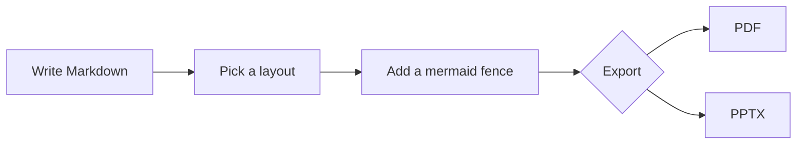

<!-- Selecting `theme: woodmark-dark` above turns the whole deck dark — every
     layout (banner, sidebar, steps, statement, lead) included. Switch back to
     light by changing it to `theme: woodmark-light`. The Mermaid renderer reads the
     same front-matter and themes diagrams to match. -->

<!-- _class: lead -->
<!-- _paginate: false -->

# Woodmark Dark Theme
## Same layouts, dark surfaces

A mid-green field, ink panels, white text — green accents unchanged

---

<!-- _class: banner -->

## How the dark theme works

- Set `theme: woodmark-dark` once in the front-matter to darken the whole deck.
- Every layout — `banner`, `sidebar`, `steps`, `statement`, `lead` — adapts.
- Inline styles still work: **bold accent**, _italic emphasis_, `inline code`.
- Diagrams follow automatically from the same front-matter.

> Blockquotes invert too: ink panel, orange border, white text.

---

## Default layout — prose, tables &amp; code

- Body copy is white on a mid-green field.
- Bullet markers keep the Woodmark green.

| Element    | Dark styling                  |
|------------|-------------------------------|
| Header row | Green background, white text   |
| Even rows  | Ink-green panel               |

```python
def greet(name: str) -> str:
    return f"Hello, {name}!"
```

---

<!-- _class: banner-subtitle -->

## banner-subtitle in the dark

### The sloped band uses ink, the divider stays green

- The header band darkens to ink; the green separator line is unchanged.
- Wave decorations are recoloured to read on the dark band.

---

<!-- _class: sidebar -->

## sidebar — dark panel

The left panel darkens to ink; the body fills the right on the mid-green field.

- Use it when the title acts as a category label.
- The diagonal divider line keeps its Woodmark green.

---

<!-- _class: steps -->

## steps in the dark

- Circle markers keep their green-and-white ring
- The descending divider line stays green
- Body text reads white on the mid-green field
- Great for ordered processes on a dark deck

---

## Mermaid — themed to match



<span class="small">The build reads `theme: woodmark-dark` and renders diagrams with the dark palette.</span>

---

<!-- _class: statement -->
<!-- _paginate: false -->

# One bold idea
on a dark canvas.

---

<!-- _class: lead -->
<!-- _paginate: false -->

# Thank You

### Questions? Comments? Feedback?

<span class="muted">Woodmark Consulting · Data &amp; AI Practice</span>
