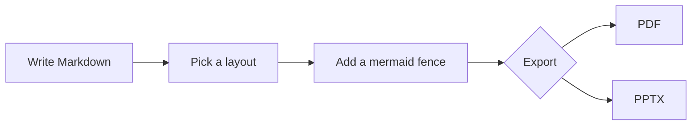
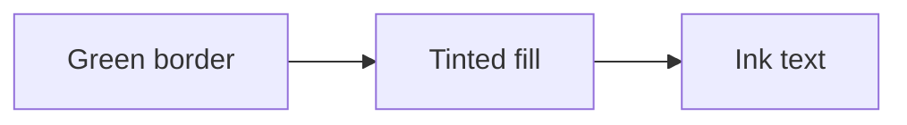

<!-- _class: lead -->
<!-- _paginate: false -->

# Woodmark Marp Template
## Layout &amp; Style Reference

A living showcase — every slide explains the feature it demonstrates

---

<!-- _class: banner -->

## How to read this deck

- Each slide is its **own documentation**: the content describes the layout or
  style being shown.
- Set a layout by placing a class directive right after the slide separator:
  `<!-- _class: banner -->`
- Combine modifiers freely, e.g. `columns banner`.
- Copy any slide as a starting point — the markdown is the spec.

> Front-matter sets `theme: woodmark-light`, `paginate: true`, plus a `header` and
> `footer`. The *“Passion for data”* corner marker is added automatically.

---

<!-- ─────────────────────────────────────────────
     SECTION 1 – DEFAULT (no class)
     ─────────────────────────────────────────── -->

## Default layout — prose &amp; bullets

No class directive ⇒ a plain white slide with a green title.

- Bullets use a green marker driven entirely by CSS.
- Inline styles work everywhere: **bold accent**, _italic emphasis_, `inline code`.
- The body starts at the standard top padding, just below the heading.
- Line height and spacing are tuned for reading at a distance.

> **Blockquote** — orange left border on a light-green tint. Use it for tips,
> definitions, and gentle emphasis.

---

## Default layout — code blocks

````markdown
```python
def greet(name: str) -> str:
    """A fenced code block — language after the backticks."""
    return f"Hello, {name}!"
```
````

```python
def greet(name: str) -> str:
    """A fenced code block — language after the backticks."""
    return f"Hello, {name}!"
```

- Code blocks have a light-green tint background and a solid green left border.
- Monospace font with relaxed line height for readability.

---

## Default layout — tables

| Element        | Styling                              | Notes                         |
|----------------|--------------------------------------|-------------------------------|
| Header row     | Green background, white text         | Always the first row          |
| Even rows      | Light-green tint                     | Zebra striping is automatic   |
| Odd rows       | Plain white                          | —                             |
| Cell text      | Racing-green ink                     | Inherits the body font        |

- Write tables in standard GitHub-flavoured Markdown.
- Alignment colons (`:---:`) are respected.

---

## Default layout — inline helper classes

<span class="small">`.small` — 0.8 em. Good for captions, sources, and footnotes.</span>

<span class="muted">`.muted` — mid-green; secondary information that should recede.</span>

<span class="note">`.note` — orange + bold; draws attention to a recommendation.</span>

<span class="warn">`.warn` — red + bold; warnings and “do not” caveats.</span>

Use them inline, mid-sentence:

- A bullet with <span class="small">a small annotation</span> appended.
- A bullet carrying a <span class="note">note marker</span> in context.
- A caution: <span class="warn">never hard-code secrets in a deck</span>.

---

<!-- ─────────────────────────────────────────────
     SECTION 2 – BANNER-SUBTITLE
     ─────────────────────────────────────────── -->

<!-- _class: banner-subtitle -->

## banner-subtitle — title with subtitle

### The `###` line becomes the subtitle

- `banner-subtitle` draws a sloped light-green band with a green divider line.
- The line sits **low**, leaving room for an `h3` subtitle under the title.
- Title and subtitle are pinned above the content; body copy starts below the band.
- Use it for section openers that need a short supporting line.

> The corner marker stays visible on every banner variant.

---

<!-- _class: banner-subtitle -->

## banner-subtitle — with a code block

### Subtitle shows Roboto Slab at the lighter weight

```css
/* Pick a layout per slide with a class directive */
<!-- _class: banner -->
```

- Any content type flows normally beneath the band.
- The band geometry is pure inline SVG — no image assets.

---

<!-- _class: banner-subtitle -->

## banner-subtitle — with a table

### Subtitle: when to choose each banner variant

| Variant           | Divider line | Best for                          |
|-------------------|--------------|-----------------------------------|
| `banner-subtitle` | Lower        | Title **plus** a subtitle         |
| `banner`          | Higher       | Title-focused content slides      |

---

<!-- ─────────────────────────────────────────────
     SECTION 3 – BANNER
     ─────────────────────────────────────────── -->

<!-- _class: banner -->

## banner — the everyday workhorse

- The band sits a little higher than `banner-subtitle`, with no subtitle slot.
- Leaves a generous content area while keeping a branded header.
- This is the recommended default for most content slides.
- Pair it with `columns` for dense, two-up layouts.

---

<!-- _class: banner -->

## banner — mixing helper classes

- A normal bullet item first.
- <span class="small">A `.small` annotation for a source or aside.</span>
- A bullet with a <span class="note">`.note` inline label</span>.
- A bullet with a <span class="warn">`.warn` inline label</span>.
- <span class="muted">A fully muted line for secondary context.</span>

> Blockquotes render correctly below every banner height.

---

<!-- _class: banner -->

## banner — code block

```js
// Options can follow the language on a Mermaid fence:
//   ```mermaid w=900 align=center
// w = width, h = max-height, align = left | center | right
```

<span class="small">Diagram options are parsed by the build-time Mermaid renderer.</span>

---

<!-- ─────────────────────────────────────────────
     SECTION 4 – COLUMNS (no banner)
     ─────────────────────────────────────────── -->

<!-- _class: columns -->

## columns — two balanced columns

- `columns` flows the body into two columns.
- The heading automatically spans **both** columns.
- Columns balance their height automatically.
- Great for comparisons and parallel lists.

- Add `columns banner` to combine with a band.
- Lists, code, tables, and quotes never split across the gap.
- Force the break point with `<div class="col-break"></div>`.
- Keep each column self-contained for clarity.

---

<!-- _class: columns -->

## columns — mixed content types

- Left column can hold prose…
- …followed by a code block:

```python
total = sum(values)
```

- Right column with a helper:
  <span class="small">small annotation under a bullet.</span>

| Right | Table |
|-------|-------|
| A     | 1     |
| B     | 2     |

---

<!-- _class: columns -->

## columns — forcing the break point

<span class="small">Text before the break flows naturally within the first column.</span>

- First item, left column
- Second item, left column
- Third item, left column

<div class="col-break"></div>

- First item — after the explicit `col-break`
- Second item, right column
- Third item, right column

<span class="muted">Insert `<div class="col-break"></div>` exactly where the second column should start.</span>

---

<!-- ─────────────────────────────────────────────
     SECTION 5 – COLUMNS + BANNER-SUBTITLE
     ─────────────────────────────────────────── -->

<!-- _class: columns banner-subtitle -->

## columns banner-subtitle — combine modifiers

- `columns` and `banner*` are independent.
- Stack them in one class directive.
- The heading still spans both columns.
- The subtitle slot is available here too.

- Order in the directive doesn’t matter.
- `columns banner-subtitle` == `banner-subtitle columns`.
- Either banner variant pairs with columns.
- Choose the variant by whether you need a subtitle.

---

<!-- _class: columns banner-subtitle -->

## columns banner-subtitle — code beside a table

```python
# Left column: a short snippet
def to_pct(x: float) -> str:
    return f"{x:.0%}"
```

| Modifier          | Pairs with `columns`? |
|-------------------|-----------------------|
| `banner-subtitle` | Yes                   |
| `banner`          | Yes                   |

---

<!-- ─────────────────────────────────────────────
     SECTION 6 – COLUMNS + BANNER
     ─────────────────────────────────────────── -->

<!-- _class: columns banner -->

## columns banner — the dense default

- Left: pair the workhorse band with two columns.
- Left: ideal for feature comparisons.
- Left: keep each bullet to a single line.
- Left: bold the **lead term** for scanning.

- Right: mirror the left for visual balance.
- Right: use _italic_ for soft emphasis.
- Right: add a <span class="muted">muted label</span> for asides.
- Right: this is the most reusable combination.

---

<!-- _class: columns banner -->

## columns banner — do &amp; don’t

- ✅ One idea per bullet
- ✅ Bold the lead term
- ✅ Use `.note` sparingly for emphasis
- ✅ Let columns balance themselves

- ⚠️ Don’t overfill a single slide
- ⚠️ Don’t split a thought across columns
- ⚠️ Don’t mix too many accent colours
- ✅ Prefer clarity over density

---

<!-- _class: columns banner -->

## columns banner — code &amp; prose

```python
# A helper worth sharing fits neatly in one column
def clamp(value, low, high):
    """Constrain value to the [low, high] range."""
    return max(low, min(value, high))
```

- Explain the snippet in the opposite column.
- Keep code short enough to read from the back row.
- Annotate with <span class="small">small captions</span> as needed.

---

<!-- ─────────────────────────────────────────────
     SECTION 7 – SIDEBAR
     ─────────────────────────────────────────── -->

<!-- _class: sidebar -->

## sidebar — title as a category label

The **sidebar** layout pins the title into a left light-green panel; the body
fills the right side.

- Use it when the title acts as a category or glossary term.
- Keep the title short — two or three words.
- The panel is bounded by a diagonal divider line.

> **Tip:** great for concept-by-concept explanations.

---

<!-- _class: sidebar -->

## sidebar — code on the right

The left panel anchors the topic; the right carries the detail.

```python
class Cache:
    """The left panel names the concept; the body explains it."""

    def __init__(self, capacity: int) -> None:
        self._store: dict[str, object] = {}
        self._capacity = capacity

    def put(self, key: str, value: object) -> None:
        self._store[key] = value
```

---

<!-- _class: sidebar -->

## sidebar — table on the right

The left title labels the data shown on the right.

| Helper class | Colour       | Weight | Typical use            |
|--------------|--------------|--------|------------------------|
| `.small`     | inherit      | normal | Captions, sources      |
| `.muted`     | mid-green    | normal | Secondary context      |
| `.note`      | orange       | bold   | Recommendations        |
| `.warn`      | red          | bold   | Warnings, “do not”     |

---

<!-- ─────────────────────────────────────────────
     SECTION 7b – STEPS (circle markers on the line)
     ─────────────────────────────────────────── -->

<!-- _class: steps -->

## steps — numbered circle markers

- Like `sidebar`, with numbered circles on the divider
- Each list item gets the next circle automatically
- The count adapts to the number of items
- Markers track the diagonal line as it descends
- Use it for ordered processes and walkthroughs
- Keep each step to a single, action-oriented line

---

<!-- _class: steps -->

## steps — a generic workflow

- Draft the deck in Markdown
- Pick a layout per slide with a class directive
- Add diagrams as `mermaid` code fences
- Preview live in VS Code
- Export to PDF or PPTX through `--config`
- Share the rendered, on-brand deck

---

<!-- ─────────────────────────────────────────────
     SECTION 8 – STATEMENT
     ─────────────────────────────────────────── -->

<!-- _class: statement -->
<!-- _paginate: false -->

# The statement layout
centers **one bold idea**
on a full slide.

---

<!-- _class: statement -->
<!-- _paginate: false -->

# Use it sparingly —
impact comes from
**contrast and restraint**.

---

<!-- ─────────────────────────────────────────────
     SECTION 9 – MERMAID
     ─────────────────────────────────────────── -->

## Mermaid — diagrams as code

Write a fenced `mermaid` block; it renders to themed SVG at **build time**.



<span class="small">Options on the fence: `w=` width, `h=` max-height, `align=` left/center/right.</span>

---

<!-- _class: sidebar -->

## Mermaid — themed automatically

Diagrams inherit the Woodmark palette without any per-diagram styling.



<span class="muted">Adjust the palette in `lib/mermaid/render.mjs`.</span>

---

<!-- ─────────────────────────────────────────────
     SECTION 10 – LEAD
     ─────────────────────────────────────────── -->

<!-- _class: lead -->
<!-- _paginate: false -->

# Section divider

### The lead layout centers a title and subtitle

<span class="small">Use it for the cover, section breaks, and the closing slide.</span>

---

<!-- _class: lead -->
<!-- _paginate: false -->

# Thank You

### Questions? Comments? Feedback?

<span class="muted">Woodmark Consulting · Data &amp; AI Practice</span>
