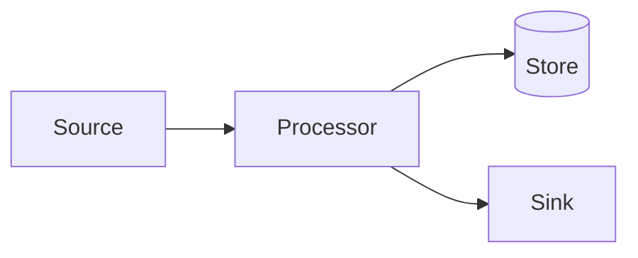

<!-- _class: lead -->
<!-- _paginate: false -->

# Presentation Title
## A short, descriptive subtitle

Author · Date · Audience

---

<!-- _class: banner -->

## Agenda

- Where we are today
- The proposed approach
- Architecture overview
- Next steps

---

## A standard content slide

Plain slides use a white background with a green title.

- Bullet points read cleanly at a distance.
- Recommendation: keep to one idea per slide.
- Secondary, de-emphasised detail.

---

## Architecture (Mermaid)

> Diagrams are rendered to themed SVG at build time — see the README.

---

<!-- _class: statement -->

# One big statement
worth pausing on.

---

<!-- _class: lead -->
<!-- _paginate: false -->

# Thank You

### Questions? Comments? Feedback?

Woodmark Consulting
